# 📘 Documentazione di Specifica e Progettazione Architetturale
## Connected Games Platform
**Progetto di Laboratorio PISSIR — A.A. 2025/2026 — Università del Piemonte Orientale**

---

## INDICE

1. **ARCHITETTURA DEI CONTAINER E RETI DOCKER**
   - 1.1 Schema dei Container e Reti Separate (Deployment Diagram)

2. **SPECIFICA DEI REQUISITI E DOMINIO APPLICATIVO**
   - 2.1 Dominio Applicativo
   - 2.2 Diagramma UML dei Casi d'Uso
   - 2.3 Descrizione Testuale di Tutti i Casi d'Uso (UC-01 .. UC-08)
   - 2.4 Diagramma UML delle Classi del Dominio

3. **PROGETTAZIONE ARCHITETTURALE A MICROSERVIZI**
   - 3.1 Pattern Architetturali Adottati
   - 3.2 Diagramma dei Package
   - 3.3 Diagramma delle Classi di Implementazione
   - 3.4 Diagrammi di Sequenza per Ogni Caso d'Uso (UC-01 .. UC-08)
   - 3.5 Definizione delle API REST (OpenAPI / Swagger YAML)
   - 3.6 Definizione dei Topic MQTT e Schema Payload

---

# 1. ARCHITETTURA DEI CONTAINER E RETI DOCKER

## 1.1 Schema dei Container e Reti Separate (Deployment Diagram)

La **Connected Games Platform** è containerizzata con Docker Compose e strutturata su **tre reti isolati (Bridge Tier)** per garantire la segregazione della sicurezza ed il controllo dei flussi multi-tenant.

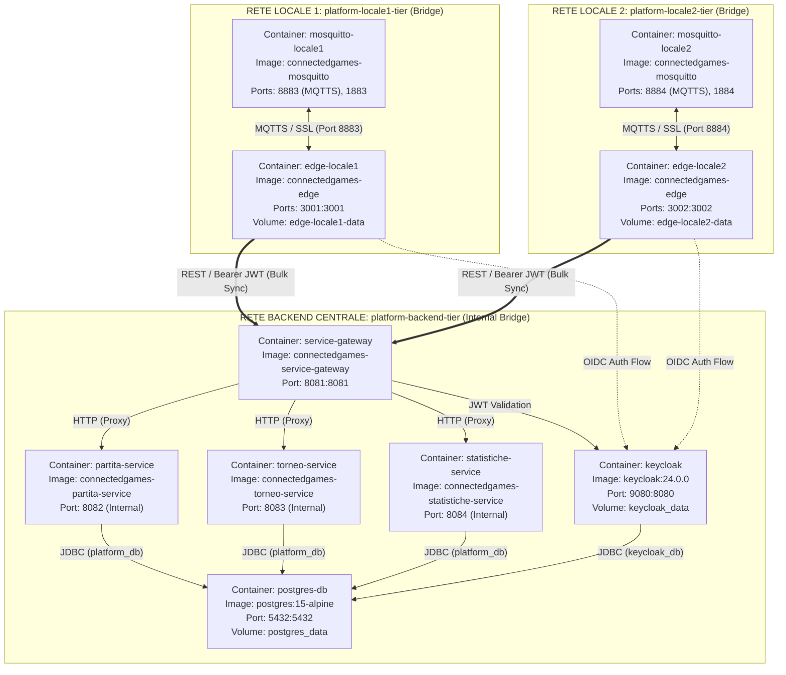

### Isolamento delle Reti:
1. **`platform-locale1-tier`**: Rete privata per il Locale 1 (Bar Belvedere). Collega solo il broker `mosquitto-locale1` e il relativo `edge-locale1`.
2. **`platform-locale2-tier`**: Rete privata per il Locale 2 (Sala Giochi Roma). Collega `mosquitto-locale2` ed `edge-locale2`.
3. **`platform-backend-tier`** *(Internal)*: Rete interna protetta del Cloud Centrale. Collega il `service-gateway`, i microservizi Spring Boot (`partita-service`, `torneo-service`, `statistiche-service`), il database `postgres-db` (con DB logici distinti `platform_db` e `keycloak_db`) e l'Identity Provider `keycloak`.

---

# 2. SPECIFICA DEI REQUISITI E DOMINIO APPLICATIVO

## 2.1 Dominio Applicativo

Il sistema gestisce tavoli da gioco fisici (Calciobalilla, Freccette) distribuibili in più locali commercialmente indipendenti.
- **Livello IoT / Sensori**: Sensori fisici o simulatori inviano eventi istantanei via MQTTS al broker locale.
- **Livello Edge**: Il nodo locale garantisce la giocabilità senza internet, bufferizzando i match conclusi su DB SQLite locale.
- **Livello Cloud**: Gestisce il bulk-sync, la federazione degli utenti con Keycloak OIDC, l'organizzazione dei tornei e la reportistica aggregata.

---

## 2.2 Diagramma UML dei Casi d'Uso

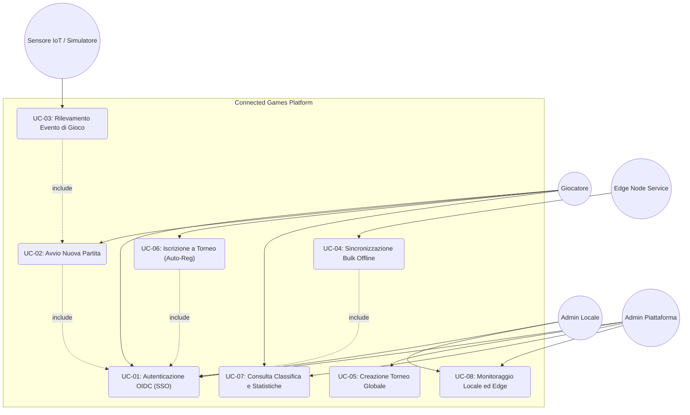

---

## 2.3 Descrizione Testuale di Tutti i Casi d'Uso

### UC-01: Autenticazione OIDC (SSO)
- **Attori**: Giocatore, Admin Locale, Admin Piattaforma.
- **Pre-condizioni**: Keycloak attivo; l'utente accede alla dashboard.
- **Flusso Principale**:
  1. L'utente clicca su "Login".
  2. Il client reindirizza su Keycloak OIDC via Authorization Code Flow con PKCE.
  3. L'utente inserisce le credenziali. Keycloak valida e restituisce l'Authorization Code.
  4. Il client scambia il codice per Access Token (JWT), ID Token e Refresh Token.
- **Post-condizioni**: Utente autenticato con il proprio ruolo Keycloak (`giocatore`, `admin_locale`, `admin_piattaforma`).

### UC-02: Avvio Nuova Partita
- **Attori**: Giocatore (1 e 2).
- **Pre-condizioni**: Edge Node operativo; Giocatore 1 autenticato.
- **Flusso Principale**:
  1. Il Giocatore 1 sceglie il gioco (Calciobalilla/Freccette) ed il secondo giocatore (autenticato o Ospite).
  2. L'Edge Node genera un UUID partita, imposta stato `IN_CORSO` e salva lo stato iniziale in SQLite `partite_attive` (Fix C1).
- **Post-condizioni**: Partita in corso pronta a ricevere eventi.

### UC-03: Rilevamento Evento di Gioco (MQTTS)
- **Attori**: Sensore IoT / Simulatore, Edge Node.
- **Pre-condizioni**: Partita in stato `IN_CORSO`.
- **Flusso Principale**:
  1. Il sensore rileva un evento (Gol / Tiro) e pubblica su `locale/{LOCALE_ID}/eventi` via MQTTS TLS (Fix C2).
  2. L'Edge Node elabora il punteggio e aggiorna SQLite `partite_attive`.
  3. Al raggiungimento della condizione di fine partita, la partita viene marcata `TERMINATA`, salvata nel buffer SQLite `partite_buffer` (`sincronizzata = 0`) e rimossa dalle partite attive.
- **Post-condizioni**: Partita conclusa salvata nel buffer offline.

### UC-04: Sincronizzazione Bulk Offline
- **Attori**: Edge Node Service, Service Gateway.
- **Pre-condizioni**: Partite non sincronizzate in SQLite (`sincronizzata = 0`).
- **Flusso Principale**:
  1. Il cron-job dell'Edge acquisisce un JWT per `edge-sync-client` via Client Credentials Grant (Fix M5).
  2. Invia `POST /api/v1/locali/{localeId}/partite/sincronizza` al Service Gateway.
  3. Il Gateway esegue `TenantVerificationGatewayFilterFactory` (Fix C3), verificando la corrispondenza del `locale_id`.
  4. `PartitaService` valida il `localeId` (Fix C4), salva le partite nel DB PostgreSQL `platform_db` ed auto-registra i giocatori.
  5. L'Edge riceve 200 OK e marca le partite come `sincronizzata = 1` in SQLite.
- **Post-condizioni**: Partite sincronizzate sul Cloud.

### UC-05: Creazione Torneo Globale
- **Attori**: Admin Piattaforma, Admin Locale.
- **Pre-condizioni**: Utente autenticato con ruolo amministrativo.
- **Flusso Principale**:
  1. L'admin definisce nome, gioco, date e locali partecipanti.
  2. Invia `POST /api/v1/tornei`. `TorneoService` salva il torneo in `platform_db`.
- **Post-condizioni**: Torneo creato ed aperto alle iscrizioni.

### UC-06: Iscrizione a Torneo (con Auto-Registrazione)
- **Attori**: Giocatore.
- **Pre-condizioni**: Giocatore autenticato; torneo non concluso.
- **Flusso Principale**:
  1. Il giocatore seleziona un torneo e invia `POST /api/v1/tornei/{torneoId}/iscrizioni`.
  2. `TorneoService` cerca l'utente in `platform_db.utente`.
  3. Se l'utente non ha mai giocato partite prima e non esiste in `platform_db`, il servizio lo auto-registra dinamente estraendo lo `username` dai claim del JWT.
  4. Salva l'iscrizione in `iscrizione_torneo`.
- **Post-condizioni**: Giocatore iscritto con successo al torneo.

### UC-07: Consulta Classifica e Statistiche
- **Attori**: Giocatore, Admin Piattaforma.
- **Pre-condizioni**: Utente autenticato o navigazione pubblica.
- **Flusso Principale**:
  1. Richiesta di `GET /api/v1/tornei/{torneoId}/classifica` o `GET /api/v1/statistiche/...`.
  2. Il servizio calcola le metriche (partite giocate, vinte, percentuale di vittoria).
- **Post-condizioni**: Classifica e statistiche restituite al client.

### UC-08: Monitoraggio Locale ed Edge
- **Attori**: Admin Locale, Admin Piattaforma.
- **Pre-condizioni**: Utente autenticato.
- **Flusso Principale**:
  1. L'admin consulta la dashboard dello stato degli Edge Node e delle installazioni di gioco.
  2. Il Gateway verifica i permessi di lettura dei dati del locale.
- **Post-condizioni**: Dati di monitoraggio visualizzati.

---

## 2.4 Diagramma UML delle Classi del Dominio

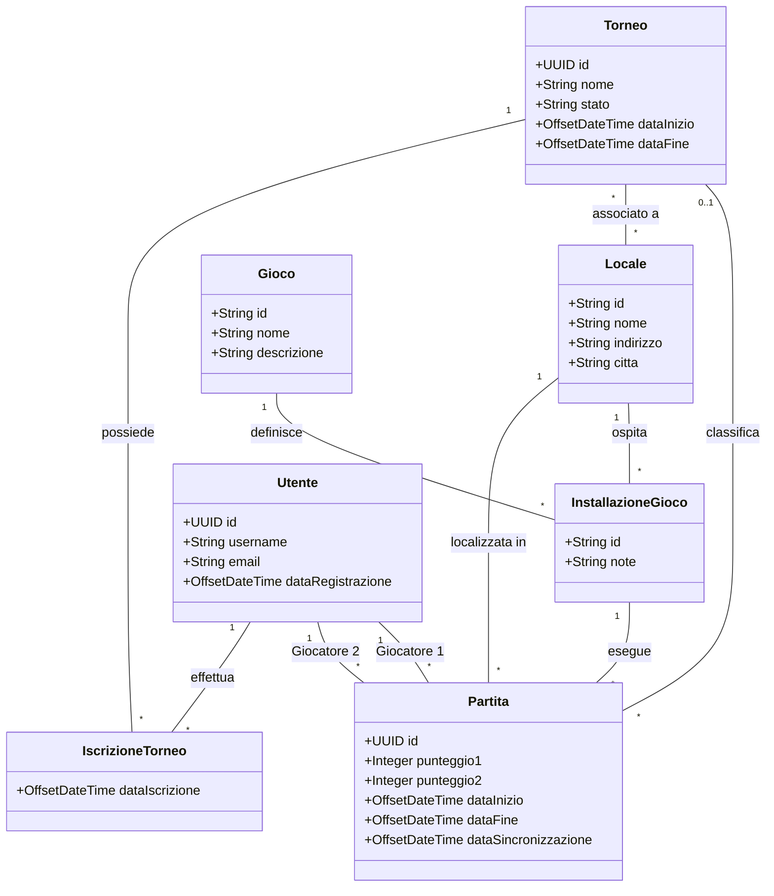

---

# 3. PROGETTAZIONE ARCHITETTURALE A MICROSERVIZI

## 3.1 Pattern Architetturali Adottati
- **API Gateway Pattern**: Router centrale e risorsa di sicurezza OAuth2/JWT.
- **Tenant Verification Filter**: Filtro Gateway per prevenire accessi ed iniezioni dati cross-tenant.
- **Store-and-Forward (Edge Resiliency)**: Buffer locale SQLite con persistenza attiva per resilienza ai crash (C1).
- **Client Credentials Flow**: Autenticazione sicura machine-to-machine per il sync background (M5).

---

## 3.2 Diagramma dei Package

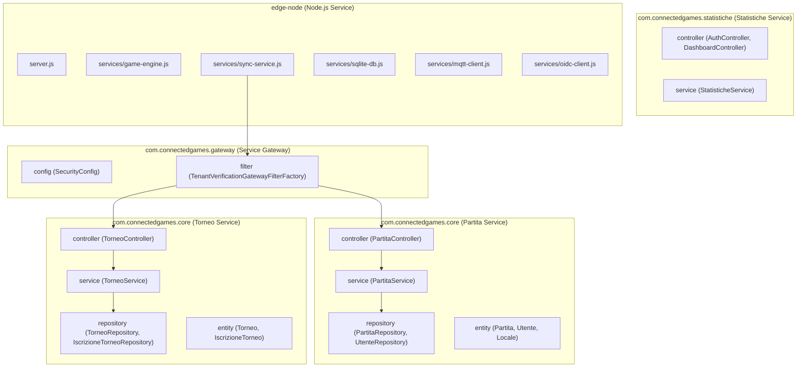

---

## 3.3 Diagramma delle Classi di Implementazione

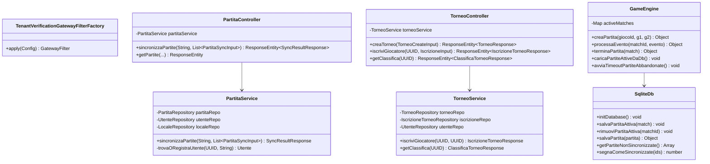

---

## 3.4 Diagrammi di Sequenza per Ciascun Caso d'Uso (UC-01 .. UC-08)

### UC-01: Autenticazione OIDC (SSO PKCE)
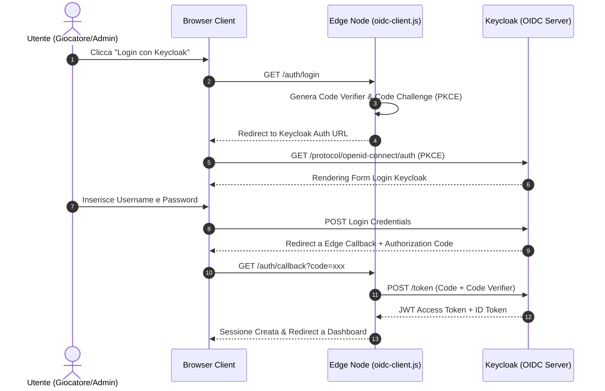

### UC-02: Avvio Nuova Partita (Match Init & SQLite Active Match)
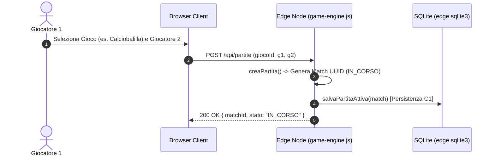

### UC-03: Rilevamento Evento di Gioco (MQTTS TLS)
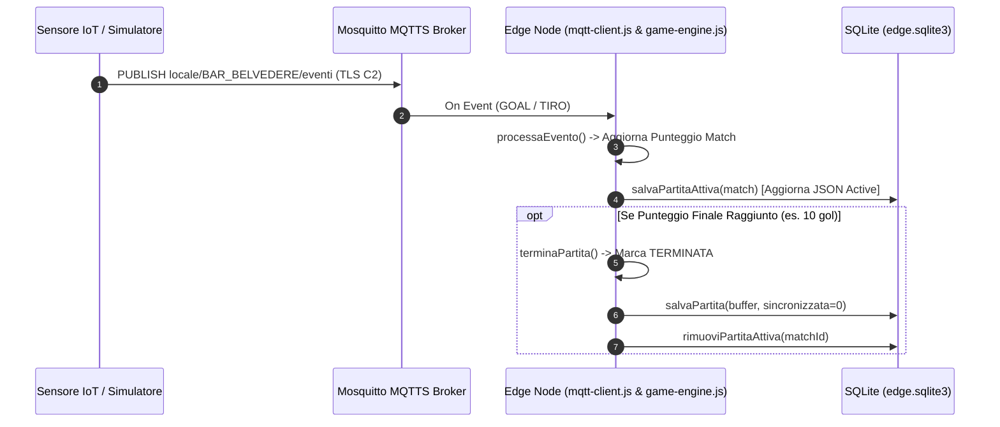

### UC-04: Sincronizzazione Bulk Offline (Client Credentials & Tenant Verification)
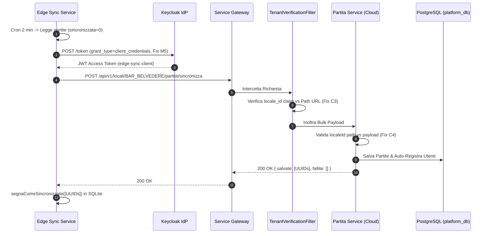

### UC-05: Creazione Torneo Globale
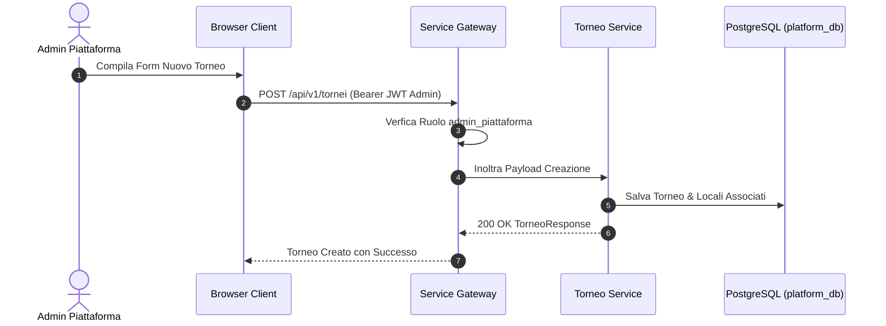

### UC-06: Iscrizione a Torneo (con Auto-Registrazione Utente)
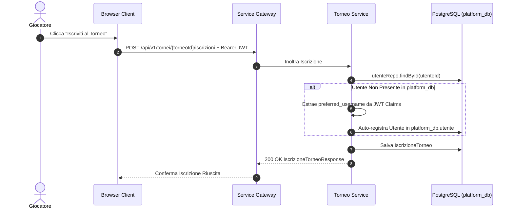

### UC-07: Consulta Classifica e Statistiche
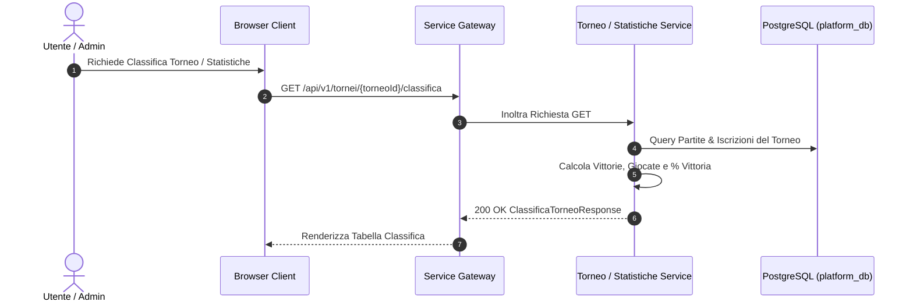

### UC-08: Monitoraggio Locale ed Edge (Health Check & Actuator)
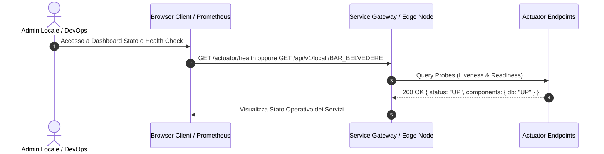

---

## 3.5 Definizione delle API REST (OpenAPI v3.0 YAML)

Le API REST della piattaforma sono formalmente specificate ed eseguibili tramite la documentazione **OpenAPI 3.0 (YAML)** situata nel codebase in:
📄 **`service-gateway/src/main/resources/static/openapi-spec.yaml`** (accessibile da Swagger UI a `http://localhost:8081/docs`).

### Specifica OpenAPI YAML Completa del Sistema:

```yaml
openapi: 3.0.3
info:
  title: Connected Games Platform — Core API Specification
  description: >
    API REST centralizzate esposte dal Service Gateway (porta 8081).
    Gestisce la sincronizzazione bulk delle partite dagli Edge Node,
    la gestione dei tornei, l'anagrafica utenti e le statistiche globali.
  version: 1.0.0

servers:
  - url: http://localhost:8081
    description: Service Gateway (Ambiente Locale / Docker)

paths:
  /api/v1/locali/{localeId}/partite/sincronizza:
    post:
      summary: Sincronizzazione massiva partite (Bulk Sync dagli Edge Node)
      description: >
        Riceve un array di partite completate dal buffer SQLite dell'Edge Node.
        Richiede autenticazione Bearer JWT e ruolo admin_piattaforma o admin_locale (con locale_id match).
      parameters:
        - name: localeId
          in: path
          required: true
          schema:
            type: string
      requestBody:
        required: true
        content:
          application/json:
            schema:
              type: array
              items:
                $ref: '#/components/schemas/PartitaSyncInput'
      responses:
        '200':
          description: Esito della sincronizzazione (partite salvate e fallite)
          content:
            application/json:
              schema:
                $ref: '#/components/schemas/SyncResultResponse'
        '403':
          description: Accesso negato (Tenant Mismatch)

  /api/v1/tornei:
    get:
      summary: Lista dei tornei
      parameters:
        - name: stato
          in: query
          required: false
          schema:
            type: string
      responses:
        '200':
          description: Lista tornei trovati
    post:
      summary: Creazione nuovo torneo
      requestBody:
        required: true
        content:
          application/json:
            schema:
              $ref: '#/components/schemas/TorneoCreateInput'
      responses:
        '200':
          description: Torneo creato con successo

  /api/v1/tornei/{torneoId}/iscrizioni:
    post:
      summary: Iscrizione di un giocatore a un torneo
      parameters:
        - name: torneoId
          in: path
          required: true
          schema:
            type: string
            format: uuid
      requestBody:
        required: true
        content:
          application/json:
            schema:
              $ref: '#/components/schemas/IscrizioneInput'
      responses:
        '200':
          description: Giocatore iscritto con successo (auto-registrazione se nuovo utente)

  /api/v1/tornei/{torneoId}/classifica:
    get:
      summary: Classifica calcolata di un torneo
      parameters:
        - name: torneoId
          in: path
          required: true
          schema:
            type: string
            format: uuid
      responses:
        '200':
          description: Classifica del torneo restituita

components:
  schemas:
    PartitaSyncInput:
      type: object
      required:
        - id
        - installazioneId
        - localeId
        - punteggio1
        - punteggio2
        - dataInizio
        - dataFine
      properties:
        id:
          type: string
          format: uuid
        installazioneId:
          type: string
        localeId:
          type: string
        giocatore1Id:
          type: string
          format: uuid
        giocatore1Username:
          type: string
        giocatore2Id:
          type: string
          format: uuid
        giocatore2Username:
          type: string
        punteggio1:
          type: integer
        punteggio2:
          type: integer
        dataInizio:
          type: string
          format: date-time
        dataFine:
          type: string
          format: date-time
        torneoId:
          type: string
          format: uuid

    SyncResultResponse:
      type: object
      properties:
        salvate:
          type: array
          items:
            type: string
            format: uuid
        fallite:
          type: array
          items:
            type: object
            properties:
              id:
                type: string
                format: uuid
              errore:
                type: string

    TorneoCreateInput:
      type: object
      required:
        - nome
        - giocoId
        - dataInizio
        - dataFine
        - localiId
      properties:
        nome:
          type: string
        giocoId:
          type: string
        dataInizio:
          type: string
          format: date-time
        dataFine:
          type: string
          format: date-time
        localiId:
          type: array
          items:
            type: string

    IscrizioneInput:
      type: object
      required:
        - utenteId
      properties:
        utenteId:
          type: string
          format: uuid
```

---

## 3.6 Definizione dei Topic MQTT e Schema Payload

Le comunicazioni IoT locali tra i sensori fisici (o simulatori) ed il broker **Mosquitto** avvengono via **MQTTS (porta 8883 / 8884)** con cifratura TLS SSL ed autenticazione tramite password file.

### Tabella dei Topic MQTT:

| Topic | Ruolo Pub | Ruolo Sub | QoS | Descrizione |
|:---|:---|:---|:---|:---|
| `locale/{LOCALE_ID}/eventi` | `simulator` | `edge-client` | `1` | Stream degli eventi di gioco (Gol, Tiri) per la partita in corso nel locale. |
| `test/ping` | `simulator` | `edge-client` | `0` | Health check del listener MQTTS Mosquitto. |

### Schema Payload Evento Calciobalilla (GOAL):
```json
{
  "tipo": "GOAL",
  "matchId": "0d640c9d-0238-47f0-9128-0af6209cc264",
  "giocoId": "calciobalilla",
  "team": "A",
  "timestamp": "2026-08-08T10:45:00.123Z"
}
```

### Schema Payload Evento Freccette 301 (TIRO):
```json
{
  "tipo": "TIRO",
  "matchId": "0d640c9d-0238-47f0-9128-0af6209cc264",
  "giocoId": "freccette",
  "settore": "20",
  "moltiplicatore": 3,
  "timestamp": "2026-08-08T10:46:12.456Z"
}
```
