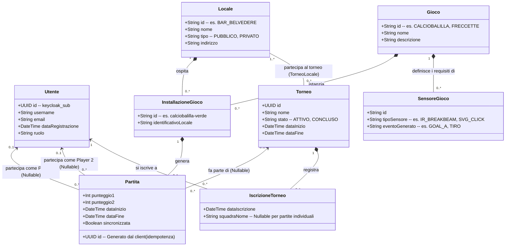

# Specifiche del Progetto: Connected Games Platform
## Fase 1: Specifica e Progettazione del Dominio (Design-First Approach)
**Corso di Laboratorio di Progettazione di Sistemi Software in Rete (PISSIR)**  
**Anno Accademico:** 2025/2026  
**Istituzione:** Università del Piemonte Orientale (UPO)  

Questo documento costituisce la specifica formale dei requisiti e la progettazione concettuale del dominio per la **Connected Games Platform**, redatto seguendo rigorosamente l'approccio **Design-First** richiesto dalle linee guida d'esame [173].

---

## 1. Obiettivo Generale del Sistema
L'obiettivo principale della piattaforma è connettere a Internet giochi fisici tradizionali (come calciobalilla e freccette) per raccogliere, analizzare e centralizzare i dati strutturati sullo svolgimento delle partite, preservando integralmente l'esperienza fisica del gioco tradizionale [51, 163, 177]. 
La piattaforma deve garantire:
1. **Tracciamento in tempo reale:** Rilevazione automatica o emulata di gol, tiri e punteggi dei giochi fisici [52, 109].
2. **Tolleranza ai guasti (Fault Tolerance):** Funzionamento ininterrotto dei giochi locali anche in assenza di connessione di rete con il Server Centrale, con buffering locale dei dati in SQLite e successivo riallineamento automatico o manuale [56, 168, 180, 185].
3. **Gestione dei Tornei Multi-Locale:** Organizzazione di competizioni a classifica aggregata (Modello A) che coinvolgono più locali fisici differenti [126, 186].
4. **Analisi e Statistiche:** Elaborazione di metriche aggregate e storiche sia globali (per gli amministratori di sistema) sia locali (per gestori e giocatori) [40, 165, 166, 171].

---

## 2. Profilazione degli Utenti e Attori (Stakeholder)
Il sistema prevede quattro livelli di autorizzazione centralizzati e gestiti tramite l'Identity Provider (Keycloak) [53, 110, 179], integrando un attore virtuale locale [53]:

*   **Giocatore:** Partecipa alle partite locali, visualizza lo stato d'occupazione dei giochi nei locali, consulta le proprie statistiche storiche di rendimento e si iscrive ai tornei della piattaforma [165, 178].
*   **Amministratore del Locale:** Gestisce l'inventario dei giochi fisici presenti nel proprio bar/sala giochi, monitora lo stato delle sessioni di gioco locali e accede alle statistiche specifiche della propria attività [166, 178].
*   **Amministratore del Gioco:** Ha la responsabilità di definire nuovi modelli di gioco nel catalogo, associare i metadati dei sensori fisici e definire le regole logiche di calcolo del punteggio (scoring) [166, 178, 187].
*   **Amministratore della Piattaforma:** Detiene il controllo amministrativo globale sull'intero ecosistema. Gestisce la registrazione di nuovi locali, il monitoraggio della rete e l'aggregazione dei dati storici [166, 178].
*   **Ospite (Attore Virtuale):** Rappresenta il profilo locale non autenticato. Viene attivato in automatico dall'Edge in assenza di rete per consentire l'utilizzo libero dei giochi [53, 113].

---

## 3. Descrizione dei Casi d'Uso Principali (UML Use Case Narrative)

### UC1: Autenticazione Utente (OIDC Authorization Code Flow)
*   **Attore Primario:** Giocatore / Amministratore Locale
*   **Precondizione:** Il gateway Edge è online (connesso ad Internet) [112].
*   **Scenario Principale:**
    1. L'utente accede all'interfaccia dell'Edge e clicca su "Accedi" [112, 142].
    2. L'Edge reindirizza il browser dell'utente alla pagina di login ospitata dal container centrale Keycloak [112, 142].
    3. L'utente digita le credenziali in totale sicurezza direttamente sul pannello Keycloak [142].
    4. Keycloak valida le credenziali, effettua il redirect dell'utente all'Edge fornendo un Authorization Code temporaneo [112, 142].
    5. L'Edge scambia l'Authorization Code via backend-to-backend con Keycloak, ottenendo il token JWT [112, 142].
    6. L'Edge memorizza il JWT in sessione per autorizzare le chiamate verso il Server Centrale (Resource Server) [112, 142].
*   **Scenario Alternativo (Connessione Assente - Fallback Guest):**
    1. L'utente preme "Accedi" ma l'Edge rileva un timeout di connessione (> 1s) verso Keycloak [113].
    2. Il sistema inibisce l'autenticazione centralizzata e sblocca il pulsante "Accedi come Ospite" [113].
    3. L'utente accede al pannello in Modalità Ospite; il suo ID utente viene impostato a `NULL` [113].

### UC2: Svolgimento Partita di Calciobalilla (Rilevazione IoT)
*   **Attore Primario:** Giocatore (Autenticato o Ospite)
*   **Precondizione:** Partita amichevole inizializzata sull'Edge.
*   **Scenario Principale:**
    1. L'utente avvia la partita. L'Edge si mette in ascolto sul topic MQTT locale (`locale/{locale_id}/eventi`) [88, 182].
    2. Durante il gioco, la pallina attraversa la porta del Team A, interrompendo il raggio del sensore a infrarossi IR Break-beam [12, 109].
    3. Il microcontrollore emulato (Simulatore) rileva l'impulso fisico e pubblica un payload JSON sul broker Mosquitto locale [15, 122].
    4. L'Edge riceve il messaggio in quanto sottoscritto al topic [15, 88].
    5. L'Edge aggiorna il punteggio in memoria incrementando il contatore del Team A [16].
    6. Al raggiungimento di 10 gol, l'Edge decreta la fine del match, salva il risultato e tenta di inoltrarlo al Server Centrale [16, 90].

### UC3: Svolgimento Partita di Freccette (Simulatore SVG Interattivo)
*   **Attore Primario:** Giocatore (Autenticato o Ospite)
*   **Precondizione:** Partita inizializzata con punteggio iniziale standard (es. 301 o 501) [9, 16].
*   **Scenario Principale:**
    1. Il giocatore visualizza sul monitor dell'Edge un tabellone vettoriale SVG interattivo [118, 123].
    2. Il giocatore clicca fisicamente su uno spicchio del cerchio SVG (es. anello Triplo del settore 20) [123].
    3. Un listener JavaScript intercetta il click, ricava il valore (`T20`) ed effettua una POST verso la rotta di simulazione dell'Edge [123].
    4. Il backend dell'Edge traduce l'evento e lo pubblica su Mosquitto per rispettare il pattern architetturale sensori-edge [123].
    5. L'Edge riceve l'evento da Mosquitto, esegue la sottrazione logica (301 - 60 = 241) e aggiorna la UI [9, 16, 123].
    6. Al raggiungimento dell'esatto punteggio zero, la partita si conclude [16].

### UC4: Sincronizzazione Partite Offline (Procedura Ibrida)
*   **Attore Primario:** Amministratore Locale / Cron-Worker di Sistema
*   **Precondizione:** Presenza di partite memorizzate nel buffer SQLite locale (`partite_buffer`) [18, 115].
*   **Scenario Principale (Cron-Job):**
    1. Ogni 5 minuti, un cron-job automatico in Node.js verifica la connessione con l'API REST centrale [120].
    2. Se il server è raggiungibile, acquisisce il semaforo booleano in memoria per evitare condizioni di corsa [121].
    3. L'Edge invia un array JSON bulk contenente le partite memorizzate in SQLite con UUID client [116, 185].
    4. Il Server Centrale (Spring Boot) elabora le righe una ad una (idempotenza garantita dall'UUID che funge da chiave unica) [185].
    5. Il server risponde con lo stato `200 OK` diviso in due array: `salvate` (inserite con successo) e `fallite` (corrotte) [116, 117].
    6. L'Edge esegue una `DELETE` su SQLite solo per gli ID inclusi nella lista `salvate` e rilascia il semaforo [69, 117, 121].
*   **Scenario Alternativo (Trigger Manuale):**
    1. L'amministratore accede al pannello diagnostico locale e clicca su "Sincronizza Ora" [120].
    2. Il sistema tenta di acquisire il semaforo di sincronizzazione [121]. Se occupato dal cron-job, la richiesta manuale viene posticipata in modo sicuro [121].

### UC5: Gestione dei Tornei (Modello A - Classifica Aggregata)
*   **Attore Primario:** Giocatore / Amministratore della Piattaforma
*   **Precondizione:** Il torneo è attivo (definito all'interno di una finestra temporale fissa) [186].
*   **Scenario Principale:**
    1. Il giocatore si autentica online sull'Edge, sbloccando la selezione dei Tornei [57, 113].
    2. Il giocatore avvia una partita associandola al `torneo_id` [186].
    3. Al completamento del match, i dati vengono trasmessi e salvati in PostgreSQL [186].
    4. Chiunque interroghi la rotta `/tornei/{id}/classifica` ottiene la classifica aggiornata in tempo reale [186]. Il server esegue una query SQL di aggregazione lazy calcolando i punteggi medi o le percentuali di vittoria su PostgreSQL per non favorire chi gioca più partite [129, 186].

---

## 4. Diagramma dei Casi d'Uso (UML Use Case Diagram in Mermaid)

```mermaid
graph TD
    %% Attori
    Giocatore((Giocatore))
    AdminLocale((Admin Locale))
    AdminGioco((Admin Gioco))
    AdminPiattaforma((Admin Piattaforma))
    Ospite((Ospite - Locale Offline))

    %% Confini del Sistema Edge
    subgraph Componente Edge (Locale)
        UC_Auth[UC1: Autenticazione OIDC]
        UC_Guest[UC1.1: Fallback Guest Mode]
        UC_Play_Calcio[UC2: Gioca Calciobalilla IoT]
        UC_Play_Darts[UC3: Gioca Freccette SVG]
        UC_Sync_Manual[UC4.1: Sincronizzazione Manuale]
        UC_Local_Stats[UC6: Visualizza Statistiche Locale]
    end

    %% Confini del Sistema Centrale
    subgraph Server Centrale (Cloud)
        UC_Sync_Auto[UC4: Sincronizzazione Batch]
        UC_Manage_Tornei[UC5: Iscrizione & Gestione Tornei]
        UC_Global_Stats[UC8: Consultazione Dashboard Statistiche]
        UC_Manage_All[UC9: Amministrazione Utenti, Locali e Giochi]
    end

    %% Relazioni Giocatore
    Giocatore --> UC_Auth
    Giocatore --> UC_Play_Calcio
    Giocatore --> UC_Play_Darts
    Giocatore --> UC_Manage_Tornei
    
    %% Relazioni Ospite
    Ospite --> UC_Guest
    Ospite --> UC_Play_Calcio
    Ospite --> UC_Play_Darts

    %% Relazioni Admin Locale
    AdminLocale --> UC_Auth
    AdminLocale --> UC_Sync_Manual
    AdminLocale --> UC_Local_Stats

    %% Relazioni Admin Gioco e Piattaforma
    AdminGioco --> UC_Manage_All
    AdminPiattaforma --> UC_Global_Stats
    AdminPiattaforma --> UC_Manage_All

    %% Relazioni Inter-Sistema
    UC_Sync_Auto -.-> |Invia dati SQLite| UC_Sync_Manual
    UC_Play_Calcio -.-> |Consuma eventi MQTT| Componente Edge
    UC_Play_Darts -.-> |Consuma eventi SVG| Componente Edge
```

---

## 5. Diagramma delle Classi del Dominio (Domain Model UML in Mermaid)
Il modello del dominio è progettato per supportare la coesistenza di partite autenticate e in modalità ospite (chiavi esterne nullable verso la tabella utenti) [29, 95, 114]. Inoltre, astrae il concetto di "gioco" e "sensore" per consentire la scalabilità futura richiesta dalle specifiche [126, 187].



### Note di Mappatura Logica e Database Relazionale
1.  **Isolamento delle credenziali:** La classe `Utente` nel nostro dominio non contiene in alcun modo campi dedicati a password, hash o salt [93]. Tutta la gestione crittografica e la validazione delle credenziali è demandata a Keycloak [93, 100]. La chiave primaria di `Utente` coincide esattamente con il `sub` (Subject) estratto dal token JWT validato dal gateway [93, 102].
2.  **Supporto per la tolleranza ai guasti (Guest Mode):** In `Partita`, i collegamenti verso i giocatori sono opzionali (molteplicità `0..1`). Se una partita viene giocata offline in modalità Ospite, i campi `player1_id` e `player2_id` saranno impostati a `NULL` nel database PostgreSQL centrale [29, 95]. Ciò previene errori di violazione d'integrità referenziale (FOREIGN KEY) durante la sincronizzazione batch [27, 29].
3.  **Idempotenza della Sincronizzazione:** Ciascuna `Partita` possiede una chiave primaria di tipo `UUID` generata a monte dal client (Edge) al momento dell'inizio del match in SQLite [97, 185]. In caso di disconnessioni temporanee in cui l'Edge non riceva la conferma di avvenuto salvataggio dal Server Centrale, la rispedizione dello stesso payload con l'identico UUID verrà intercettata da PostgreSQL come "chiave duplicata" senza generare record spuri, garantendo la consistenza assoluta dei dati di gioco [185].
