# Documento di Implementazione Architetturale
## Connected Games Platform
**Progetto di Laboratorio PISSIR — A.A. 2025/2026 — Università del Piemonte Orientale**  
**Autori:** Foutih Osama, Bellotti Lorenzo, Riccardo Negrini

---

## INDICE
1. **ARCHITETTURA DI DEPLOYMENT E CONTAINER DOCKER**
   - 1.1 Diagramma di Deployment (PlantUML)
   - 1.2 Descrizione delle Reti e Volumi Containerizzati
2. **DIAGRAMMA DEI PACKAGE DI IMPLEMENTAZIONE**
   - 2.1 Diagramma dei Package (PlantUML)
3. **DIAGRAMMA DELLE CLASSI DI IMPLEMENTAZIONE**
   - 3.1 Diagramma delle Classi Backend ed Edge (PlantUML)
4. **DIAGRAMMI DI SEQUENZA DEI FLUSSI CRITICI**
   - 4.1 UC-01: Autenticazione OIDC (SSO PKCE)
   - 4.2 UC-02: Avvio Nuova Partita ed Persistenza SQLite
   - 4.3 UC-03: Rilevamento Evento MQTTS e Chiusura Partita
   - 4.4 UC-04: Sincronizzazione Bulk Offline e Tenant Verification
5. **DEFINIZIONE DELLE API REST (OpenAPI 3.0)**
   - 5.1 Endpoint Principali del Service Gateway
6. **DEFINIZIONE DEI TOPIC MQTT E SCHEMA PAYLOAD**
   - 6.1 Topic MQTTS e Struttura JSON degli Eventi IoT

---

# 1. ARCHITETTURA DI DEPLOYMENT E CONTAINER DOCKER

## 1.1 Diagramma di Deployment (PlantUML)

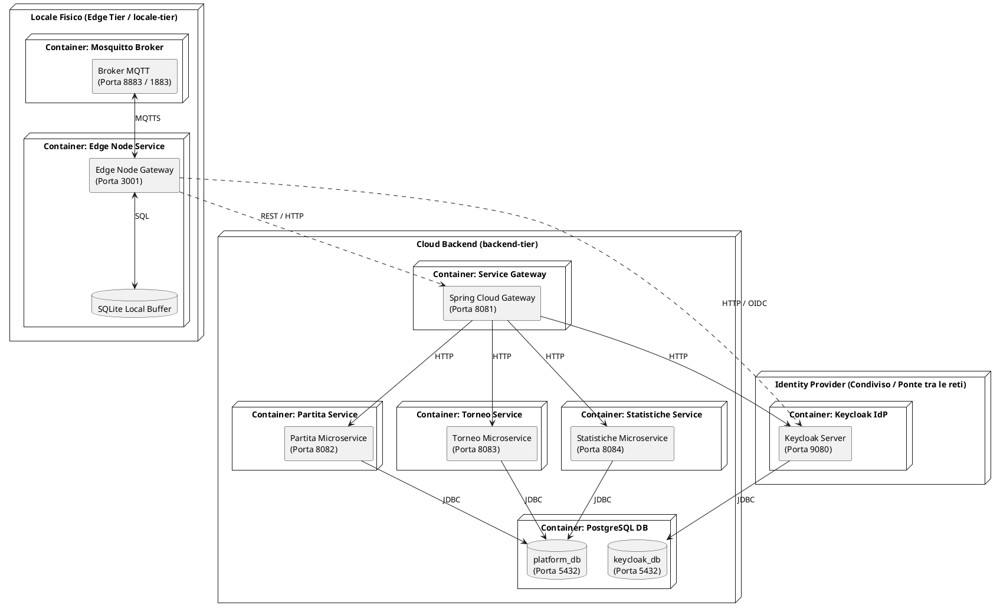

## 1.2 Descrizione delle Reti e Volumi Containerizzati
* **Reti Private Edge (`locale1-tier`, `locale2-tier`)**: Rete isolata per ciascun locale fisico. Collega il broker Mosquitto ed il nodo Edge locale. A questa rete appartiene anche il container **Keycloak**, permettendo ai client e nodi Edge di effettuare il login OIDC.
* **Rete Backend Cloud (`platform-backend-tier`)**: Rete interna riservata al backend che collega il Service Gateway, i microservizi Spring Boot (`partita-service`, `torneo-service`, `statistiche-service`), il DB PostgreSQL e **Keycloak** (per la validazione token JWT via backchannel).
* **Volumi Persistenti**: Volumi Docker dedicati per la persistenza dei dati PostgreSQL (`postgres_data`), di Keycloak (`keycloak_data`) e dei buffer SQLite sui nodi Edge.

---

# 2. DIAGRAMMA DEI PACKAGE DI IMPLEMENTAZIONE

## 2.1 Diagramma dei Package (PlantUML)

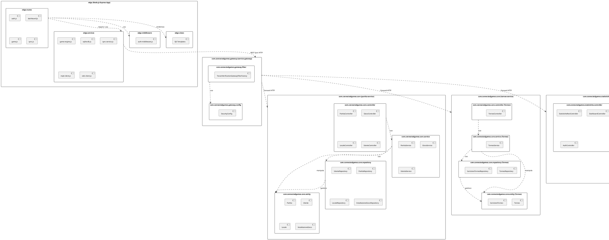

---

# 3. DIAGRAMMA DELLE CLASSI DI IMPLEMENTAZIONE

## 3.1 Diagramma delle Classi Backend ed Edge (PlantUML)

```plantuml
@startuml Diagramma_Classi_Implementazione_Connected_Games

skinparam classAttributeIconSize 0
skinparam shadowing false
skinparam packageStyle rectangle

package "Service Gateway (service-gateway)" {
  class TenantVerificationGatewayFilterFactory {
    + apply(Config config) : GatewayFilter
  }
}

package "Partita Service (partita-service)" {
  class PartitaController {
    - PartitaService partitaService
    + sincronizzaPartite(String localeId, List<PartitaSyncInput> partite) : ResponseEntity<SyncResultResponse>
    + getPartite(String localeId, String giocoId, UUID giocatoreId, int page, int size) : ResponseEntity<Page<PartitaDetailResponse>>
    + getPartitaById(UUID partitaId) : ResponseEntity<PartitaDetailResponse>
  }

  class PartitaService {
    - PartitaRepository partitaRepo
    - UtenteRepository utenteRepo
    - LocaleRepository localeRepo
    - GiocoRepository giocoRepo
    - InstallazioneGiocoRepository installazioneRepo
    + sincronizzaPartite(String localeId, List<PartitaSyncInput> partite) : SyncResultResponse
    + getPartite(String localeId, String giocoId, UUID giocatoreId, int page, int size) : Page<PartitaDetailResponse>
    + getPartitaById(UUID partitaId) : PartitaDetailResponse
    - trovaORegistraUtente(UUID utenteId, String username) : Utente
  }
}

package "Torneo Service (torneo-service)" {
  class TorneoController {
    - TorneoService torneoService
    + getTornei(String stato) : ResponseEntity<List<TorneoResponse>>
    + getTorneoById(UUID torneoId) : ResponseEntity<TorneoResponse>
    + creaTorneo(TorneoCreateInput input) : ResponseEntity<TorneoResponse>
    + iscriviGiocatore(UUID torneoId, IscrizioneInput input) : ResponseEntity<IscrizioneTorneoResponse>
    + getClassifica(UUID torneoId) : ResponseEntity<ClassificaTorneoResponse>
    + cancellaTorneo(UUID torneoId) : void
  }

  class TorneoService {
    - TorneoRepository torneoRepo
    - IscrizioneTorneoRepository iscrizioneRepo
    - UtenteRepository utenteRepo
    - GiocoRepository giocoRepo
    + getTornei(String stato) : List<TorneoResponse>
    + creaTorneo(TorneoCreateInput input) : TorneoResponse
    + iscriviGiocatore(UUID torneoId, UUID utenteId, String localeId) : IscrizioneTorneoResponse
    + getClassifica(UUID torneoId) : ClassificaTorneoResponse
  }
}

package "Statistiche Service (statistiche-service)" {
  class StatisticheRestController {
    - StatisticheBackendService statisticheService
    + getStatistiche(Integer giorni, String giocoId) : ResponseEntity<StatisticheGlobaliResponse>
    + getStatisticheLocale(String localeId) : ResponseEntity<StatisticheLocaleResponse>
    + getStatisticheUtente(UUID utenteId) : ResponseEntity<StatisticheUtenteResponse>
  }

  class StatisticheBackendService {
    - StatisticheRepository repository
    + getStatisticheGlobali(Integer giorni, String giocoId) : StatisticheGlobaliResponse
    + getStatistichePerLocale(String localeId) : StatisticheLocaleResponse
    + getStatistichePerUtente(UUID utenteId) : StatisticheUtenteResponse
  }
}

package "Modulo Edge Node (edge - Node.js)" {
  class GameEngine {
    - Map activeMatches
    + creaPartita(giocoId, g1, g2) : Object
    + processaEvento(matchId, evento) : Object
    + terminaPartita(match) : Object
    + caricaPartiteAttiveDaDb() : void
    + initInstallazioni() : Promise
  }

  class SqliteDb {
    + initDatabase() : Database
    + salvaPartitaAttiva(match) : void
    + rimuoviPartitaAttiva(matchId) : void
    + salvaPartita(partita) : Object
    + getPartiteNonSincronizzate() : Array
    + segnaComeSincronizzate(ids) : number
    + getStatsLocale() : Object
  }

  class SyncService {
    + avviaCronSync() : void
    + eseguiSyncBulk() : Promise
  }
}

' === RELAZIONI DI INIEZIONE ED UTILIZZO ===
PartitaController --> PartitaService
TorneoController --> TorneoService
StatisticheRestController --> StatisticheBackendService
GameEngine --> SqliteDb
SyncService --> SqliteDb

@enduml
```

---

# 4. DIAGRAMMI DI SEQUENZA DEI FLUSSI CRITICI (UC-01 .. UC-08)

## 4.1 UC-01: Autenticazione OIDC (SSO PKCE)
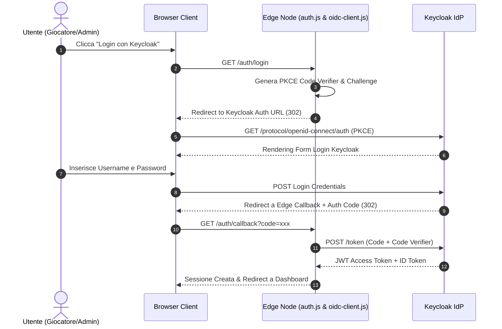

## 4.2 UC-02: Avvio Nuova Partita ed Persistenza SQLite
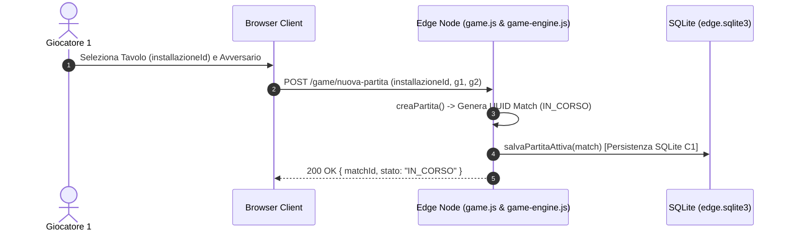

## 4.3 UC-03: Rilevamento Evento MQTTS e Chiusura Partita
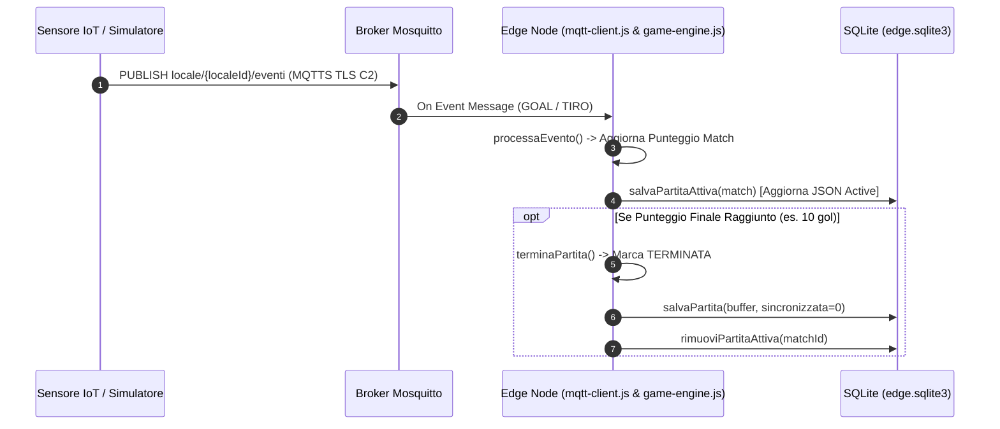

## 4.4 UC-04: Sincronizzazione Bulk Offline e Tenant Verification
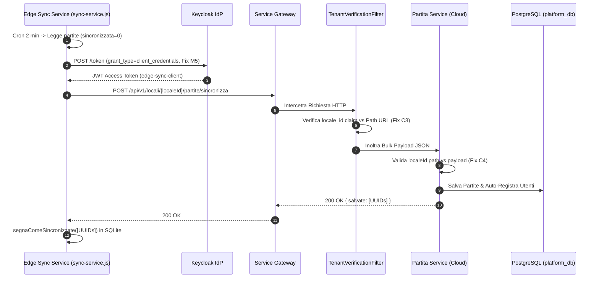

## 4.5 UC-05: Creazione Torneo Globale
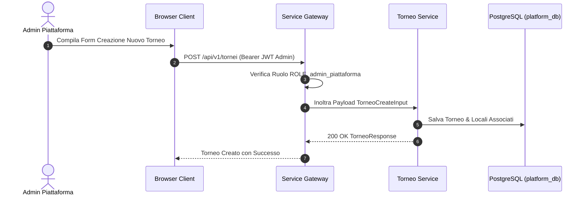

## 4.6 UC-06: Iscrizione a Torneo (con Auto-Registrazione Utente)
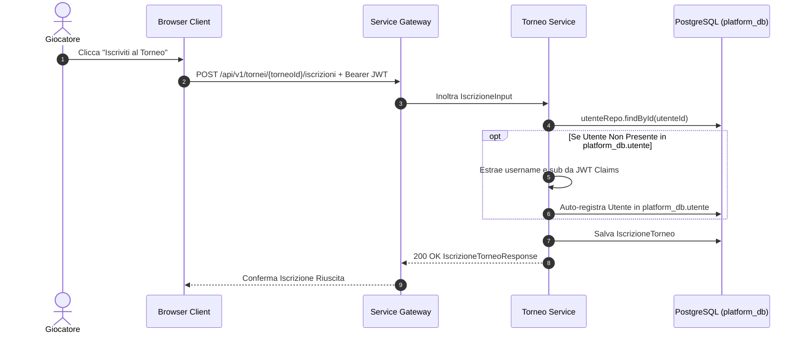

## 4.7 UC-07: Consulta Classifica e Statistiche
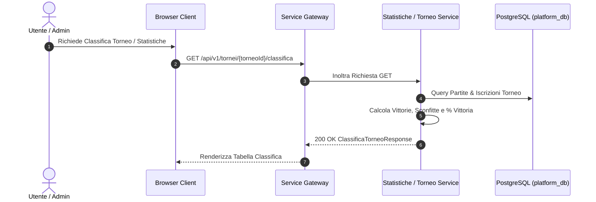

## 4.8 UC-08: Monitoraggio Stato Locale ed Edge
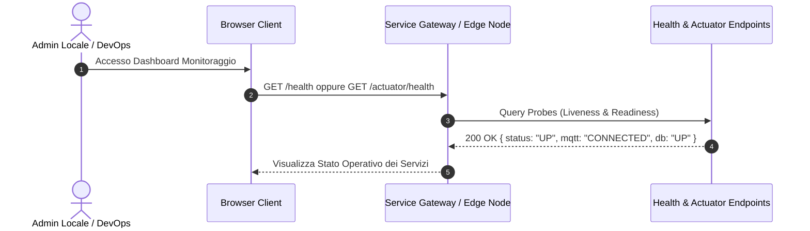

---

# 5. DEFINIZIONE DELLE API REST (OpenAPI 3.0)

Le API REST centralizzate della piattaforma sono gestite dal **Service Gateway (Porta 8081)**.

| Metodo | Endpoint URL | Descrizione / Ruolo Richiesto |
| :--- | :--- | :--- |
| `POST` | `/api/v1/locali/{localeId}/partite/sincronizza` | Bulk Sync partite da Edge Node (`admin_locale`, `admin_piattaforma`). |
| `GET` | `/api/v1/tornei` | Restituisce la lista di tutti i tornei attivi ed aperti. |
| `POST` | `/api/v1/tornei` | Creazione di un nuovo torneo globale (`admin_piattaforma`). |
| `POST` | `/api/v1/tornei/{torneoId}/iscrizioni` | Iscrizione di un giocatore a un torneo con auto-registrazione sul DB. |
| `GET` | `/api/v1/tornei/{torneoId}/classifica` | Calcola e restituisce la classifica in tempo reale del torneo. |
| `GET` | `/api/v1/statistiche/giocatore/{utenteId}` | Restituisce lo storico e le statistiche aggregate di un giocatore. |

*Nota di riferimento*: La specifica completa eseguibile è disponibile nel file OpenAPI Swagger [`service-gateway/src/main/resources/static/openapi-spec.yaml`](file:///Users/osamafoutih/Desktop/Università/3anno/pissir/progetto/connectedgames/service-gateway/src/main/resources/static/openapi-spec.yaml).

---

# 6. DEFINIZIONE DEI TOPIC MQTT E SCHEMA PAYLOAD

## 6.1 Sicurezza della Comunicazione IoT: MQTTS TLS e Controllo Accessi ACL

La comunicazione tra i dispositivi fisici (sensori, simulatori) ed il nodo Edge locale avviene su protocollo **MQTTS** sicuro per prevenire manomissioni del punteggio o intercettazioni dei dati sul canale di comunicazione locale.

### 1. Cifratura del Canale via MQTTS TLS (Porta 8883)
* **Cifratura del Traffico**: Tutta la comunicazione transitante sul broker Mosquitto viene cifrata end-to-end tramite **TLS (Transport Layer Security)** sulla porta `8883`.
* **Certificati X.509 e CA**: Il broker Mosquitto carica il certificato del server (`server.crt`) e la chiave privata (`server.key`). Il client Node.js (`mqtt-client.js`) ed i sensori validano l'autenticità del broker verificando il certificato della Certificate Authority radice (`MQTT_CA_PATH = /mosquitto/config/certs/ca.crt`).
* **Protezione dai Rischi**: Impedisce attacchi di eavsdropping (intercettazione in chiaro dei pacchetti sulla LAN del locale) e attacchi Man-In-The-Middle (MITM).

### 2. Controllo degli Accessi tramite ACL (Access Control Lists in `acl.conf`)
Il broker applica il **Principio del Minimo Privilegio** definendo utenti distinti in `passwords.txt` con permessi granulari stabiliti in `acl.conf`:
* **Utente `simulator` (Sensori / Dispositivi di Gioco)**:
  * **Permesso**: Esclusivamente `WRITE` (pubblicazione).
  * **Scope**: Limitato al pattern dei topic del proprio locale `locale/{LOCALE_ID}/+/+`.
  * **Scopo**: Può solo inviare i segnali dei gol/tiri e non ha visibilità sui messaggi degli altri sensori né sulle risposte del sistema.
* **Utente `edge-client` (Nodo Edge Node.js)**:
  * **Permesso**: Esclusivamente `READ` (sottoscrizione).
  * **Scope**: Pattern wildcard `locale/{LOCALE_ID}/+/+`.
  * **Scopo**: Ascolta gli eventi di gioco elaborati dal motore locale ma non può iniettare o falsificare arbitrariamente eventi sul canale MQTT.

---

## 6.2 Struttura Gerarchica dei Topic MQTT

I topic seguono la convenzione a tre livelli: `locale/{localeId}/{giocoId}/{tipoEvento}`

| Topic MQTT | Direzione | Permessi ACL (`acl.conf`) | Descrizione |
| :--- | :--- | :--- | :--- |
| `locale/{localeId}/+/+` | Sensore $\rightarrow$ Edge Node | `user simulator`: WRITE<br>`user edge-client`: READ | Pattern wildcard per sottoscrivere tutti i giochi (`calciobalilla`, `freccette`, `biliardo`) e tutti i tipi evento del locale. |
| `locale/{localeId}/calciobalilla/goal` | Sensore Gol $\rightarrow$ Edge | `write` (user simulator) | Evento di rilevamento gol sul tavolo di calciobalilla. |
| `locale/{localeId}/freccette/tiro` | Bersaglio $\rightarrow$ Edge | `write` (user simulator) | Evento di impatto freccetta nel settore bersaglio. |
| `locale/{localeId}/biliardo/buca` | Sensore Buca $\rightarrow$ Edge | `write` (user simulator) | Evento di imbucata bilia. |

---

## 6.3 Schema del Payload JSON degli Eventi IoT

Il payload inviato sui topic specifici (es. `locale/BAR_BELVEDERE/calciobalilla/goal`) segue lo schema JSON elaborato da `mqtt-client.js` e consumato da `game-engine.js`:

```json
{
  "matchId": "f47ac10b-58cc-4372-a567-0e02b2c3d479",
  "installazioneId": "calciobalilla-locale1",
  "team": "A",
  "tipo": "GOAL",
  "punti": 1,
  "timestamp": "2026-08-21T09:45:00.000Z"
}
```
