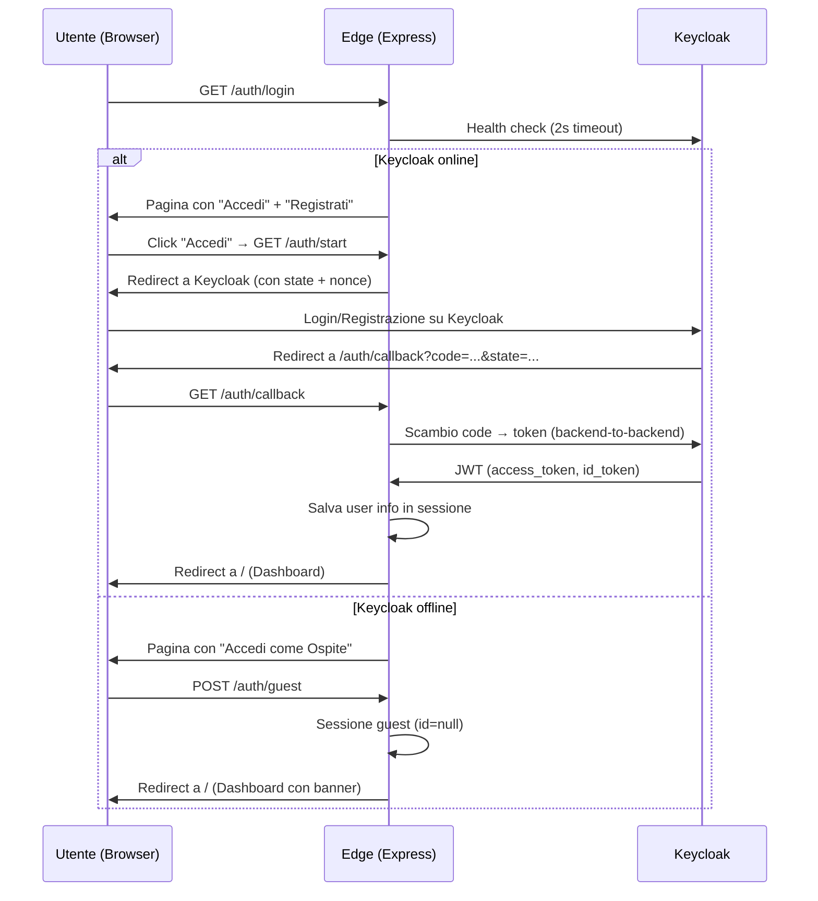

# Walkthrough — Edge Node + MQTT Broker

## Riepilogo delle Modifiche

### 1. Fix Bug service-core (2 file)

| File | Problema | Fix |
|------|----------|-----|
| [Torneo.java](file:///Users/osamafoutih/Desktop/Università/3anno/pissir/progetto/connectedgames/service-core/src/main/java/com/connectedgames/core/entity/Torneo.java#L9) | Import `ManyToOne` mancante → non compilava | Aggiunto `import jakarta.persistence.ManyToOne` |
| [PartitaSyncInput.java](file:///Users/osamafoutih/Desktop/Università/3anno/pissir/progetto/connectedgames/service-core/src/main/java/com/connectedgames/core/dto/PartitaSyncInput.java#L16-L17) | `@NotNull` su primitivo `int` → inutile | Cambiato `int` → `Integer` |

---

### 2. Infrastruttura Docker (7 file nuovi, 2 aggiornati)

#### [init-db.sql](file:///Users/osamafoutih/Desktop/Università/3anno/pissir/progetto/connectedgames/init-db.sql) [NEW]
- Crea database `platform_db` e `keycloak_db`
- Crea schema `platform_db` (necessario per il mapping JPA `@Table(schema = "platform_db")`)
- Tutte le tabelle DDL + indici
- Seed data: 2 locali, 2 giochi, 3 sensori, 4 installazioni

#### [realm-export.json](file:///Users/osamafoutih/Desktop/Università/3anno/pissir/progetto/connectedgames/keycloak/realm-export.json) [NEW]
- Realm `pissir-realm` con self-registration abilitata
- Client OIDC `edge-app` (confidential, Authorization Code Flow)
- 4 realm roles: `giocatore`, `admin_locale`, `admin_gioco`, `admin_piattaforma`
- Protocol mapper per includere `realm_roles` nel JWT
- 4 utenti di test pre-configurati

#### Mosquitto (4 file nuovi)
- [entrypoint.sh](file:///Users/osamafoutih/Desktop/Università/3anno/pissir/progetto/connectedgames/mosquitto/entrypoint.sh) — genera password file a runtime da env vars
- [locale1/mosquitto.conf](file:///Users/osamafoutih/Desktop/Università/3anno/pissir/progetto/connectedgames/mosquitto/locale1/mosquitto.conf) + [acl.conf](file:///Users/osamafoutih/Desktop/Università/3anno/pissir/progetto/connectedgames/mosquitto/locale1/acl.conf) — porta 1883, no TLS, ACL per `BAR_BELVEDERE`
- [locale2/mosquitto.conf](file:///Users/osamafoutih/Desktop/Università/3anno/pissir/progetto/connectedgames/mosquitto/locale2/mosquitto.conf) + [acl.conf](file:///Users/osamafoutih/Desktop/Università/3anno/pissir/progetto/connectedgames/mosquitto/locale2/acl.conf) — idem per `SALA_GIOCHI_ROMA`

#### [docker-compose.yml](file:///Users/osamafoutih/Desktop/Università/3anno/pissir/progetto/connectedgames/docker-compose.yml) [MODIFIED]
Modifiche principali rispetto alla versione precedente:
- **Mosquitto**: rimosso TLS (porta 1883 al posto di 8883), aggiunto `entrypoint.sh`, env vars per credenziali
- **Keycloak**: aggiunto alla rete `edge-tier` (necessario per OIDC backend-to-backend)
- **Edge**: aggiunto `KEYCLOAK_INTERNAL_URL`, `KEYCLOAK_CLIENT_ID/SECRET`, `SESSION_SECRET`; cambiato MQTT da `mqtts://` a `mqtt://`
- **Tutte le credenziali** parametrizzate via `${VAR:-default}` con fallback dev

#### [.env.example](file:///Users/osamafoutih/Desktop/Università/3anno/pissir/progetto/connectedgames/.env.example) [MODIFIED]
- Aggiunti: `KEYCLOAK_CLIENT_ID`, `KEYCLOAK_CLIENT_SECRET`, `SESSION_SECRET`
- Rimossi: `KC_DB_PASSWORD`, `EDGE1_MQTT_PASSWORD`, `EDGE2_MQTT_PASSWORD` (ridondanti)

---

### 3. Edge Node (10 file nuovi)

```
edge/
├── Dockerfile
├── package.json
├── server.js                    # Express app, sessione, MQTT, health check
├── middleware/
│   └── auth.js                  # requireAuth, requireOnlineAuth
├── routes/
│   ├── auth.js                  # Login/Register/Callback/Guest/Logout OIDC
│   └── dashboard.js             # Dashboard principale
├── services/
│   ├── mqtt-client.js           # Connessione Mosquitto, subscribe, EventEmitter
│   └── oidc-client.js           # Discovery, auth URL, token exchange, userinfo
└── views/
    ├── partials/
    │   ├── header.ejs           # HTML head, navbar, CSS design system
    │   └── footer.ejs           # Chiusura HTML
    ├── login.ejs                # Login + Register + Guest Mode
    ├── dashboard.ejs            # Status cards + game placeholder
    └── error.ejs                # Pagina errore generica
```

#### Flusso di autenticazione implementato



---

## Validazione Effettuata

- ✅ `docker compose config` — valido (2 warning su `version` obsoleta, non bloccanti)
- ✅ Import `ManyToOne` aggiunto in `Torneo.java`
- ✅ Tipi `Integer` in `PartitaSyncInput.java`
- ✅ Struttura file completa verificata

---

## Come Provare

```bash
# 1. Avvia lo stack completo
docker compose up --build

# 2. Attendi che tutti i container siano healthy (~1-2 minuti)

# 3. Apri nel browser:
#    Edge Locale 1: http://localhost:3001
#    Edge Locale 2: http://localhost:3002
#    Keycloak Admin: http://localhost:9080 (admin / admin)

# 4. Test registrazione:
#    - Click "Registrati" → compila il form su Keycloak → redirect alla dashboard

# 5. Test login:
#    - Click "Accedi" → usa giocatore1 / password123 → dashboard con badge ruoli

# 6. Test Guest Mode (blackout simulato):
#    - docker network disconnect platform-edge-tier edge-locale1
#    - Ricarica http://localhost:3001/auth/login → appare "Accedi come Ospite"
```
